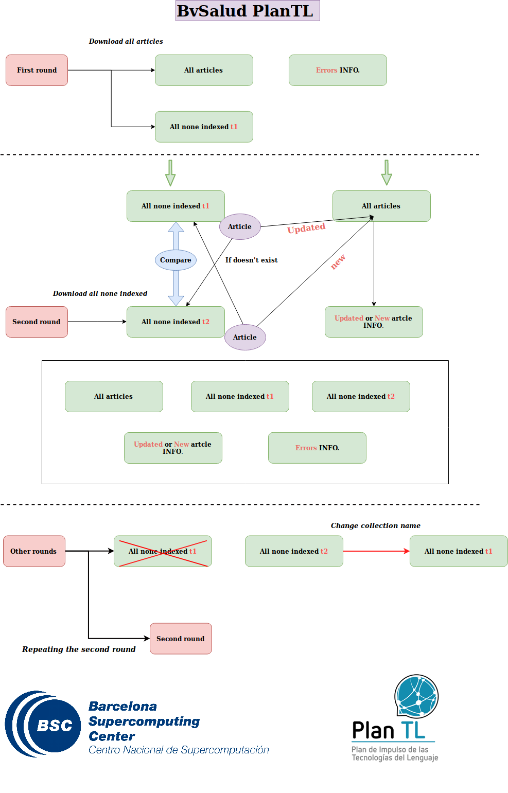

# BvSalud PlanTL

## INTRODCTION
BvSalud is a program that download all articles from [bvsalud](http://pesquisa.bvsalud.org/portal/), LILACS and IBECS and save into the MongoDB. As you will have noticed that they have mililons of article, so downloading all articles always is waste of time, when can just download those don't exist in your DATA BASE. 

### REQUERIMENT

- **BeautifulSoup:**

    `pip: $ pip install beautifulSoup`
    
    
- **pymongo:**

    `pip: $ pip install pymongo` 
    

## TUTORIAL
If you are going to excecute this program for the first time or you don't have any data in MongoDB than you should give it a condition (argument).
Otherwise, you don't have to pass it any argument.


- ### First round:
    ```bash
    bash: $ python parse_xml_new_and_update.py all

    ```
    For first time you have to run it with the argument **"all"**. It will download all articles to you MongoDb in DB **bvs** and collection **training_collection_All**, even it will create the collection **training_collection_None_Indexed_t1** with all none_indexed articles.
    
    **Result (MongoDB):**

    - **bvs** *(DB)*:
        - **training_collection_All** *(Collection)*:  This collection will contain all articles.
        - **training_collection_None_Indexed_t1** *(Collection)*:  This collection will just contain none indexed articles.
----------------------------------------------------  
- ### Second round:
    ```bash
    bash: $ python parse_xml_new_and_update.py

    ```
    This is for second round and you must run it without any argument. Make sure it's not the first time. In this round program will compare all none indexed article if they have been indexed or there are any new article. 
    It will save all new article directly and others that have been indexed update, in the collection.
    
    **Result (MongoDB):**
    - **bvs** *(DB)*:
        - **training_collection_All** *(Collection)*:  This collection will contain all articles, new arrived and old.
        - **training_collection_None_Indexed_t1** *(Collection)*:  This collection just containts old none indexed. 
        - **training_collection_None_Indexed_t2** *(Collection)*:  This collection will contain all new and old none indexed.
        - **training_collection_Update_info** *(Collection)*: This collection saves information about none indexed articles, if those are new or just have been updated to indexed, and also save the date.
        - **errors_training** *(Collection)*: Save all errors occurred while saving 
-----------------------------------------------------------------
- ### Next other rounds:
    ```bash
    bash: $ python parse_xml_new_and_update.py

    ```
    This is for all next rounds. you must run it without any argument. Make sure it's not the first time. In these round program will do same as **second round**
    
    **Result (MongoDB):**
    - **bvs** *(DB)*:
        - **training_collection_All** *(Collection)*:  This collection will contain all articles, ***new arrived none indexed*** and update ***all none indexed to indexed***.
        - **training_collection_None_Indexed_t1** *(Collection)*:  This collection is a copy of ***training_collection_None_Indexed_t2***, those that have been indexed between all this time.
        - **training_collection_None_Indexed_t2** *(Collection)*:  This collection will contain ***all new none indexed***.    
        -----------------------------------------------------------------

        - **old_training_collection_All** *(Collection)*:  This is the copy of old collection, *training_collection_All.*
        - **old_training_collection_None_Indexed_t1** *(Collection)*: his is the copy of old collection, *training_collection_None_Indexed_t1.*
-----------------------------------------------------------------
    




For more information click [cl](https://bvsalud-documents-save-into-mongo.readthedocs.io/en/latest/BVSalud_Documents_save_into_mongo.html#module-Crawl_Records)


